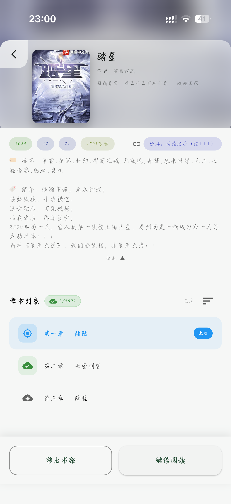
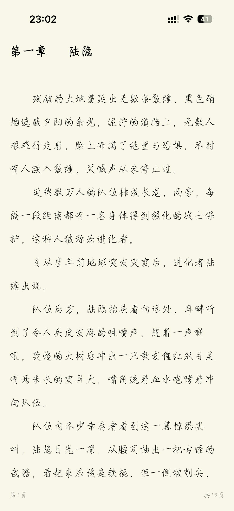
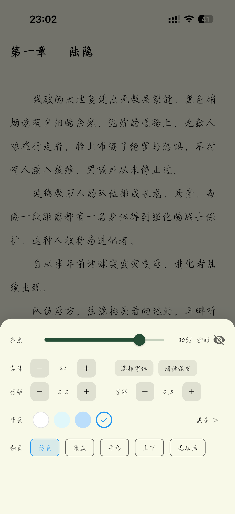

# Reader Nover

一款由 Flutter 与 Rust 实现的阅读器。它支持导入、管理和使用阅读书源来发现、搜索和阅读书籍，并提供书架、书城、沉浸式阅读和听书等完整阅读流程 (请自行探索)。

Flutter 提供统一的多端界面与交互，Rust 通过 `flutter_rust_bridge` 承担书源规则等核心能力；项目保留了 Android、iOS、macOS、Windows、Linux 和 Web 平台工程，具备持续扩展到多端的基础。

> 本项目只提供阅读工具与书源规则能力，不内置或分发任何书源、书籍内容及其版权资源。请仅导入和使用你有权访问的内容。

## 界面预览

| 书架 | 书城与分类 | 跨书源搜索 |
| --- | --- | --- |
|  |  |  |

| 书籍详情与目录 | 沉浸式阅读 | 阅读设置 |
| --- | --- | --- |
|  |  |  |

## 功能

- 书源：导入、导出、分组、启用、检查与管理书源，支持需要 WebView 登录或 JavaScript 渲染的书源。
- 发现与搜索：按书源浏览分类，在多个已启用书源中搜索书名或作者，并查看书籍详情与章节目录。
- 书架：添加、排序和管理书籍，保存阅读进度并展示更新状态。
- 阅读器：章节目录、缓存下载、书签、批注、亮度、字体、字号、行距、字距、背景与多种翻页方式。
- 听书：基于系统 TTS 的朗读、进度跟随与后台音频会话支持。
- 本地文件：导入 TXT、EPUB 等本地书籍。
- 数据：使用 SQLite（Drift）保存书架、阅读进度、书源和阅读数据。

## 技术栈

- [Flutter](https://flutter.dev/)：界面、跨平台运行时与应用层。
- [Rust](https://www.rust-lang.org/)：通过 [flutter_rust_bridge](https://github.com/fzyzcjy/flutter_rust_bridge) 与 Flutter 互操作，执行书源规则相关逻辑。
- GetX、Dio、Drift/SQLite、`flutter_inappwebview` 与系统 TTS。

## 开始使用

当前仓库中的 Rust 原生库已预编译并由 `rust_builder` 插件提供，正常运行 Android 或 iOS 应用无需另行构建 Rust。

### 环境要求

- Flutter SDK，Dart SDK 版本 `^3.5.4`
- Android Studio 或 Xcode，以及相应目标平台的 Flutter 开发环境

### 运行

```bash
flutter pub get
flutter run
```

连接设备或启动模拟器后，使用 `flutter devices` 查看可用目标。首次使用时，在应用的“书源”页面导入你有权使用的书源配置，再从书城或搜索页开始阅读。

### 测试与静态检查

```bash
flutter analyze
flutter test
```

## 项目结构

```text
lib/
  pages/          页面与阅读器交互
  app/service/    书源、书籍、本地导入、阅读与 TTS 服务
  rust/           Flutter 与 Rust 的桥接接口
  app/database/   Drift 数据库与模型
rust_builder/     预编译 Rust 原生库的 Flutter FFI 插件
assets/relase/    应用截图
```

## 贡献与致谢

欢迎通过 Issue 提交问题、建议和可复现步骤，也欢迎提交改进文档、测试或功能的 Pull Request。

本项目的阅读器与书源能力在设计和实现上参考了以下优秀开源项目，感谢其贡献：

- [fluttercandies/flutter_novel](https://github.com/fluttercandies/flutter_novel)
- [gedoor/legado](https://github.com/gedoor/legado)
