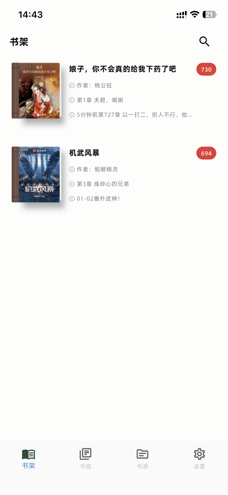
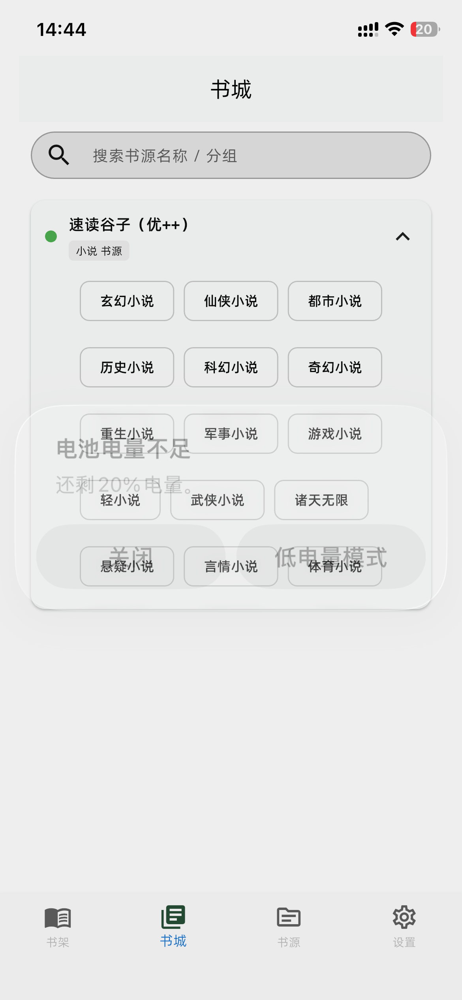
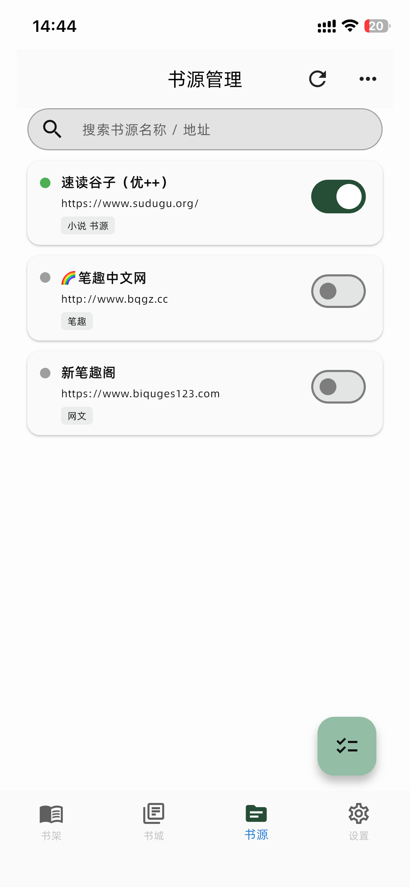
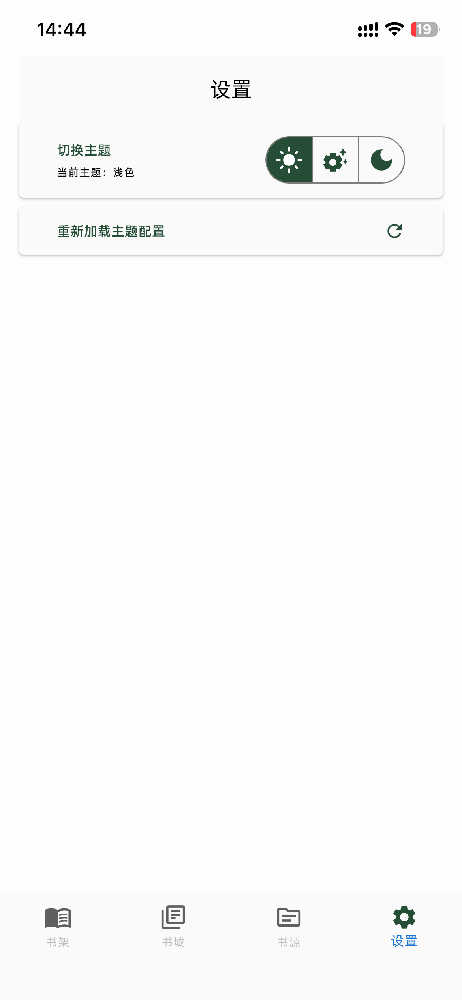
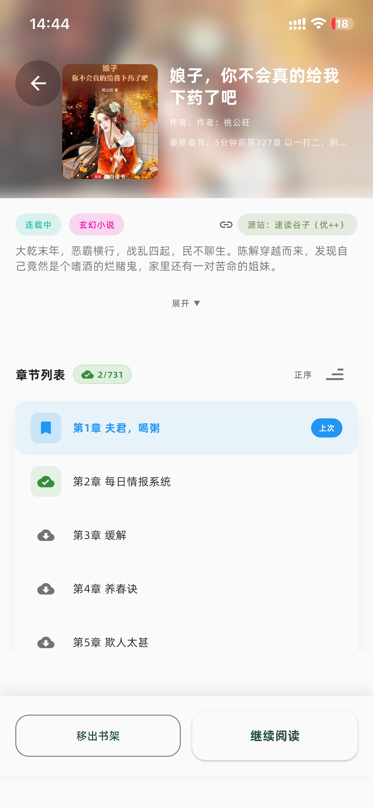
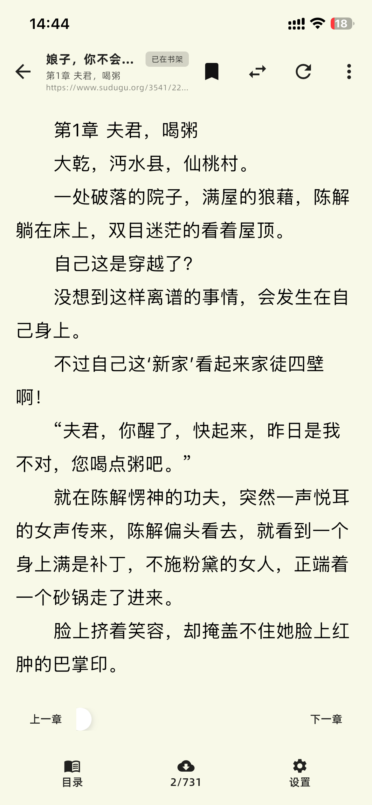
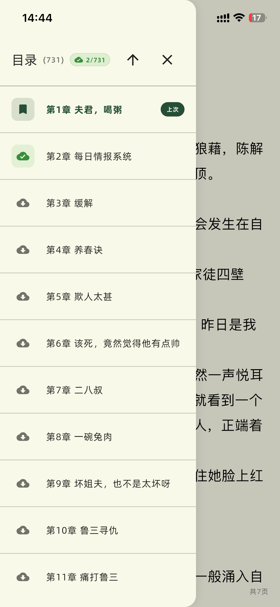
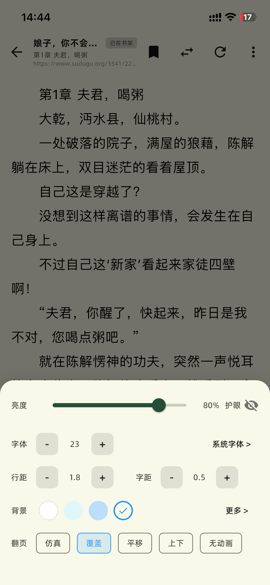

# 📖 Novel Reader App

一款简洁优雅的小说阅读器应用，专为热爱阅读的你打造。

## 📱 应用截图

<table>
  <tr>
    <td></td>
    <td></td>
    <td></td>
  </tr>
  <tr>
    <td></td>
    <td></td>
    <td></td>
  </tr>
  <tr>
    <td></td>
    <td></td>
    <td></td>
  </tr>
</table>
## ✨ 功能特性

- 📚 **书架管理** - 轻松管理你的小说收藏
- 📖 **沉浸阅读** - 简洁的阅读界面，专注于内容
- 🔖 **阅读进度** - 自动记录阅读位置，随时继续
- 🌙 **护眼模式** - 支持多种阅读主题
- ⚙️ **个性设置** - 自定义字体、字号、背景等

## 🤝 参与贡献

这个项目还在持续完善中，非常欢迎你的参与！

### 如何贡献
> 💬 有任何问题或建议，欢迎 [提交 Issue](../../issues/new)，让我们一起把这个阅读器做得更好！
